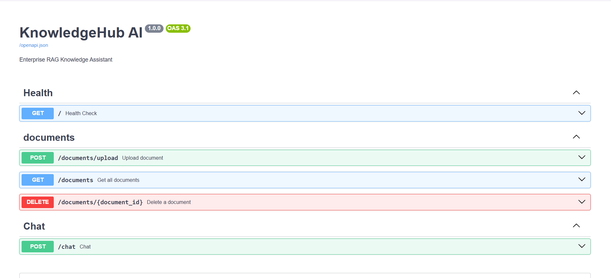

# KnowledgeHub AI

A Retrieval-Augmented Generation (RAG) backend built with FastAPI, ChromaDB, Ollama, and Docker.

The application allows users to upload PDF documents, indexes them into a vector database using embeddings, and answers questions using only the uploaded documents.

---

## Features

- Upload PDF documents
- Automatic document parsing and chunking
- Local embeddings using Ollama
- Semantic search with ChromaDB
- Retrieval-Augmented Generation (RAG)
- Distance-based relevance filtering
- Document listing
- Document deletion
- Dockerized deployment
- Structured logging
- Custom exception handling
- Swagger/OpenAPI documentation

---

## Tech Stack

- Python 3.12
- FastAPI
- Ollama
- ChromaDB
- Pydantic
- Docker
- Uvicorn

---

## Project Structure

```
app/
├── api/
├── chunking/
├── core/
├── exceptions/
├── parsers/
├── prompts/
├── rag/
├── schemas/
├── services/
├── utils/
└── vectorstore/
```

---

## Architecture

```
PDF
 │
 ▼
Upload API
 │
 ▼
Document Service
 │
 ▼
Indexing Service
 │
 ├── PDF Parser
 ├── Text Chunker
 ├── Embedding Service
 └── ChromaDB
        │
        ▼
 Search Service
        │
        ▼
 RAG Service
        │
        ▼
 Ollama
        │
        ▼
 Answer
```

---

## Screenshots

### Swagger



### Chat


## Running Locally

Clone the repository

```bash
git clone <repo-url>
cd knowledgehub-ai
```

Create a `.env` file

```env
MODEL_NAME=nomic-embed-text
LLM_MODEL=qwen3:4b

OLLAMA_BASE_URL=http://host.docker.internal:11434

CHROMA_DIR=./chroma_db
UPLOAD_DIR=./uploads

TOP_K=3
SIMILARITY_THRESHOLD=1.2
```

Install dependencies

```bash
pip install -r requirements.txt
```

Start the application

```bash
uvicorn app.main:app --reload
```

Or run with Docker

```bash
docker compose up --build
```

---

## API Endpoints

| Method | Endpoint | Description |
|--------|----------|-------------|
| POST | `/documents/upload` | Upload PDF |
| GET | `/documents` | List uploaded documents |
| DELETE | `/documents/{filename}` | Delete document |
| POST | `/chat` | Ask questions |
| GET | `/` | Health check |

---
